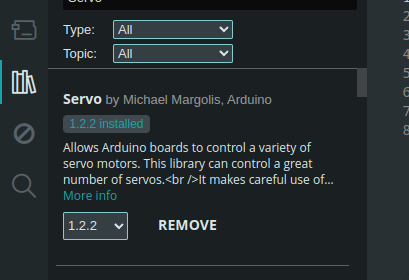
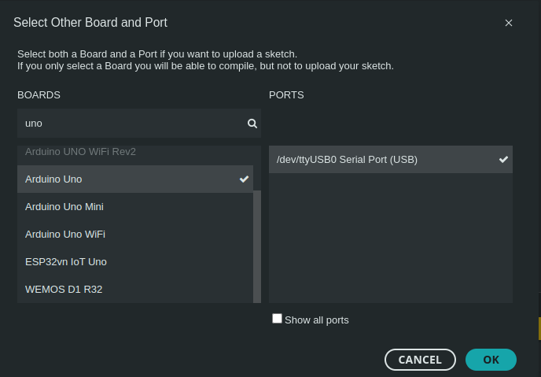
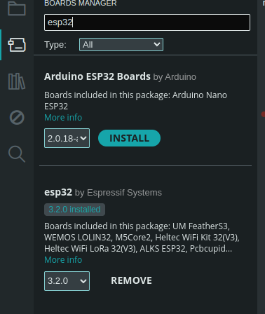

# Robotics_elegoov4Car
Repository for the ElegooV4Car with camera

## Building/Uploading

The main method used to build and upload the code to the ElegooV4Car is by using either [ArduinoIDE](https://www.arduino.cc/en/software/),or by [PlatformIO Extention running in VSCode](https://docs.platformio.org/en/latest/integration/ide/vscode.html) 
###  Using Arduino IDE 
#### Arduino UNO code upload 
 - Dependencies
 > You need to have installed the Arduino AVR Boards package to be able to Select the Arduino UNO board option. 
 > You also need the Servo Libarry installed: 
 > 
 - Configuration 
 > Simply choose the **Arduino UNO** board option, along with the needed COM/TTY port
 > 

 Now you should be able to build and upload the code for the ArduinoUNO part of the ElegooV4Car. 
#### ESP32 code upload 
- Dependencies
> You need to install the **esp32** package from **Espressif Systems** from the **Boards Manager**: 
> 
- Configuration 
> You need to select the **ESP32 Dev Module**, along with the COM/TTY port of the camera/ESP32.: 
> **You also need the following options Selectedfor uploading to the ESP32:**
>  - USB CDC On Boot: **Enabled**
>  - Flash mode: **QIO (80MHz)**
>  - Flash size: **4MB**
>  - Partition Scheme: **Huge App (3MB No OTA/1MB SPIFFS)**

 Now you should be able to build and upload the code for the Camera of the ElegooV4Car

###  Using PlatformIO
Once you have installed [PlatformIO and VScode](#buildinguploading), you should be able to configure the library dependencies and upload options from the `platformio.ini` file. 
```ini
[platformio]
default_envs = esp32_cam
```
#### Arduino UNO code upload 
- Configuration
```ini
[env:uno]
platform = atmelavr
board = uno
framework = arduino
lib_deps = 
	arduino-libraries/Servo@^1.2.2
monitor_speed = 9600
```

#### ESP32 code upload 
- Configuration
```ini
[env:esp32_cam]
platform = espressif32
board = esp32-s3-devkitc-1
board_build.f_cpu = 240000000L
framework = arduino
build_src_filter = "+<Camera_main.cpp>"`
board_build.arduino.memory_type = qio_opi
board_build.flash_mode = qio
board_build.f_flash = 80000000L
board_upload.flash_size = 8MB
board_build.partitions = huge_app.csv
build_flags  = 
  -D ARDUINO_USB_MODE = 1
  -D ARDUINO_USB_CDC_ON_BOOT=1
  -D BOARD_HAS_PSRAM = 1
```

## Extra Documentation
You can generate documentation of the sourse code using [Doxygen](https://www.doxygen.nl/index.html). 
Simply run: 
```shell
$ doxygen Doxyfile
```
in the base directory of the project. The generated output files will be in the `doxygen_output` directory. 
